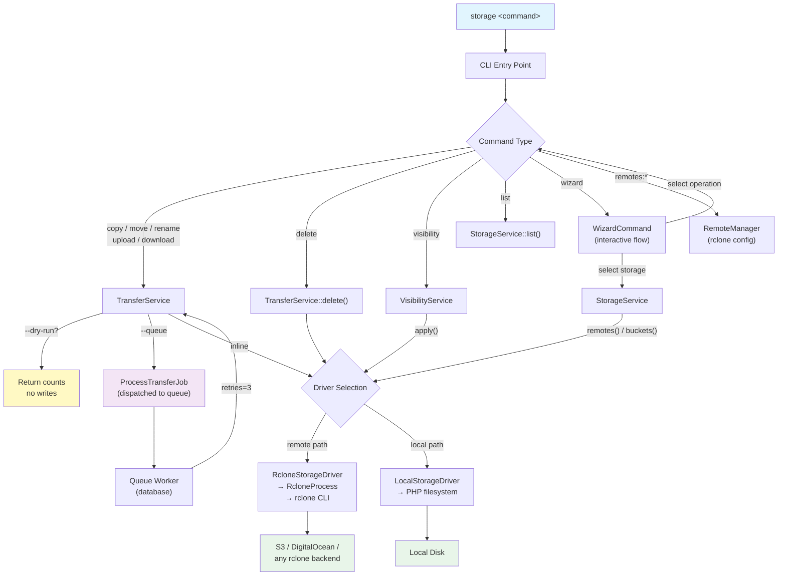
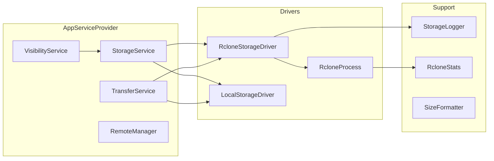
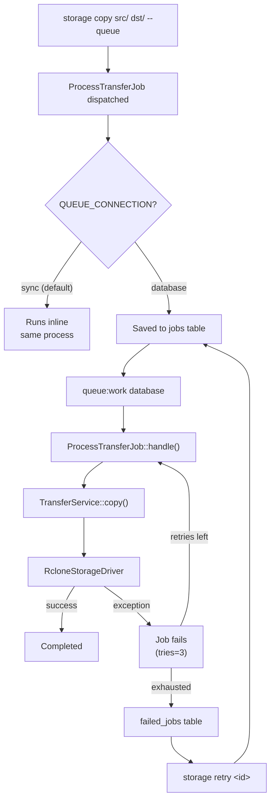

# Storage Manager CLI

Production-grade **Laravel Zero** CLI for managing files/objects across
rclone remotes, S3-compatible storage, and local filesystems.

## Requirements

- PHP ^8.3
- [rclone](https://rclone.org) on `PATH` (for remote operations)
- AWS CLI (`aws`, `s3api`) for remote visibility changes

## Install

```bash
# Development
php storage-manage-cli list

# Build standalone binary
php storage-manage-cli app:build storage
./builds/storage list
```

## All Commands

### `list` — Browse storage contents

```bash
# List a remote bucket prefix
storage list do-spaces-nyc:my-data/videos/

# List a local directory
storage list /home/user/downloads/

# List only directories
storage list do-spaces-nyc:my-data/ --type dirs

# List only files (with recursive; -R is short for --recursive)
storage list do-spaces-nyc:my-data/ --type files -R

# Sort directories by size descending, files by name ascending
storage list remote:bucket/dir/ --sort-dir size-desc --sort-file asc

# Sort files from smallest to largest
storage list remote:bucket/dir/ --sort-file size
```

`--type` accepts `all`, `dirs` or `files`; `--sort-dir`/`--sort-file` accept
`asc`, `desc`, `size` or `size-desc`. An unrecognised value is rejected with
exit code `2` rather than silently returning an empty listing.

A path that does not exist exits `3` (not found), matching the behaviour of the
transfer commands. On object stores an empty prefix and a missing prefix are
indistinguishable, so a remote prefix with nothing in it reports the same way;
an empty *local* directory lists `(empty)` and exits `0`.

Running `storage` with no arguments prints the command index.

### `copy` — Copy objects between locations

```bash
# Copy a remote prefix to another remote
storage copy do-spaces-nyc:my-data/videos/ do-spaces-sgp:backup/movies/

# Copy a single file
storage copy do-spaces-nyc:my-data/report.pdf do-spaces-sgp:backup/report.pdf

# Dry run (preview without changes)
storage copy /home/user/backups/ do-spaces-nyc:my-data/backups/ --dry-run

# Copy with overwrite (replace existing dest objects)
storage copy src:bucket/data/ dst:bucket/data/ --overwrite

# Copy with progress bar
storage copy src:bucket/large-files/ dst:bucket/large-files/ --progress

# Queue the operation (run later with queue:work)
storage copy src:bucket/data/ dst:bucket/backup/ --queue
```

### `move` — Move objects (copy → verify → delete source)

```bash
# Move between remotes
storage move do-spaces-nyc:my-data/archive/ do-spaces-sgp:backup/archive/

# Move a single file
storage move do-spaces-nyc:my-data/old-report.pdf do-spaces-nyc:my-data/archive/old-report.pdf

# Dry run
storage move src:bucket/data/ dst:bucket/data/ --dry-run

# Move with progress
storage move src:bucket/large-files/ dst:bucket/archive/ --progress
```

Any transfer with at least one remote end runs as a **single rclone process**
(`move` / `moveto`), which copies each object, verifies it at the destination
and only then deletes the source — in parallel, and server-side where the
backend supports it. Objects skipped because the destination already exists
keep their source copy. Emptied source prefixes are removed.

### `upload` — Upload local files to storage

```bash
# Upload a directory
storage upload /home/user/photos/ do-spaces-nyc:my-data/photos/

# Upload a single file
storage upload /home/user/report.pdf do-spaces-nyc:my-data/reports/report.pdf

# Dry run
storage upload /home/user/backups/ do-spaces-nyc:my-data/backups/ --dry-run

# Upload with overwrite
storage upload /home/user/data/ do-spaces-nyc:my-data/data/ --overwrite
```

### `download` — Download from storage to local

```bash
# Download a remote prefix
storage download do-spaces-nyc:my-data/videos/ /home/user/videos/

# Download a single file
storage download do-spaces-nyc:my-data/report.pdf /home/user/report.pdf

# Dry run
storage download do-spaces-nyc:my-data/backups/ /home/user/backup/ --dry-run
```

### `duplicate` — Copy and keep the source

```bash
# Duplicate a file
storage duplicate do-spaces-nyc:my-data/report.pdf do-spaces-nyc:my-data/report-backup.pdf

# Duplicate a prefix
storage duplicate do-spaces-nyc:my-data/configs/ do-spaces-nyc:my-data/configs-backup/
```

### `rename` — Rename/relocate objects

```bash
# Rename a file
storage rename do-spaces-nyc:my-data/old-name.pdf do-spaces-nyc:my-data/new-name.pdf

# Move to a different prefix
storage rename do-spaces-nyc:my-data/report.pdf do-spaces-nyc:archive/report.pdf

# Relocate a whole prefix (e.g. into a trash prefix)
storage rename do-spaces-nyc:my-data/tickets/ do-spaces-nyc:my-data/_trash-tickets/
```

`rename` shares `move`'s engine and semantics. A source that does not exist
exits `3` instead of reporting a successful no-op.

### `delete` — Delete objects or prefixes

```bash
# Delete with confirmation prompt
storage delete do-spaces-nyc:my-data/tmp/

# Force delete (skip confirmation)
storage delete do-spaces-nyc:my-data/tmp/ --force

# Dry run (show what would be deleted)
storage delete do-spaces-nyc:my-data/tmp/ --dry-run
```

`delete` checks the path before doing anything: a path that is not there exits
`3` with `Nothing found at: …`, so a typo can never look like a completed
deletion. A path that exists but holds no objects reports `Nothing to delete.`
and exits `0`.

### `visibility` — Set object visibility (private/public)

```bash
# Make a file public
storage visibility do-spaces-nyc:my-data/photo.jpg public

# Make a file private
storage visibility do-spaces-nyc:my-data/photo.jpg private

# Apply recursively to a prefix
storage visibility do-spaces-nyc:my-data/public/ public --recursive

# Dry run
storage visibility do-spaces-nyc:my-data/public/ public --recursive --dry-run
```

### `wizard` — Interactive operation builder

```bash
# Launch the wizard
storage wizard

# Preload from a saved config
storage wizard --config my-backup

# Save the operation as a config
storage wizard --save-as daily-backup
```

### `remotes` — Manage rclone remotes

```bash
# List all configured remotes
storage remotes
storage list-remotes

# Show a remote's config (secrets redacted)
storage remotes:show myremote

# Add a new S3 remote
storage remotes:add myremote s3 provider=DigitalOcean \
  access_key_id=xxx secret_access_key=yyy endpoint=nyc3.digitaloceanspaces.com

# Add a local remote
storage remotes:add localbackup local

# Remove a remote
storage remotes:forget myremote --force
```

### `configs` — Saved wizard profiles

```bash
# List saved configs
storage configs
storage list-configs

# Save a config
storage configs:save daily-backup src:bucket/data/ dst:bucket/backup/ \
  --operation=copy --overwrite --recursive

# Delete a config
storage configs:forget daily-backup
```

### `retry` — Re-dispatch failed queue jobs

```bash
# Retry a specific job
storage retry 5

# Retry multiple jobs
storage retry 5 8 12

# Retry all failed jobs
storage retry all
```

Called without an ID, `retry` lists the failed transfer jobs. Called with IDs
that match nothing, it exits `1` — re-dispatching nothing is a failure, not a
success. When some IDs match and others do not, it exits `6` (partial).

## Queue System

Transfer commands support `--queue` to dispatch operations as background jobs:

```bash
# Queue a copy operation
storage copy src:bucket/data/ dst:bucket/backup/ --queue

# Process queued jobs
QUEUE_CONNECTION=database storage queue:work database --stop-when-empty

# Retry failed jobs
storage retry all
```

## Architecture

The CLI follows a layered design: **Commands** parse arguments and render
output, **Services** hold transfer/visibility logic, and **Drivers** talk to
backends. Laravel's container wires everything in `AppServiceProvider`.



### Service Wiring

`AppServiceProvider` binds singletons so each command receives injected
dependencies:



### Queue & Retry Flow

Transfer commands accept `--queue` to defer work to a background job.
Failed jobs land in `failed_jobs` and can be re-dispatched with `retry`.



## Path Syntax

```text
<remote>:<bucket>/<path>      # rclone remote
/path/to/local/dir/           # local filesystem
local:/path/to/local/dir      # explicit local
```

A **trailing slash** marks a directory/prefix. Copying a directory moves its
**contents** into the destination (never nests the source name).

Object keys may contain spaces — quote the argument as usual for your shell:

```bash
storage copy "do-spaces-nyc:my-data/My Reports/Q3 final.pdf" /home/user/reports/
```

Only the part before the first `:` is read as a remote name, so a local path
that contains a colon needs the explicit `local:` prefix.

## Shared Transfer Options

| Option | Description |
| --- | --- |
| `--overwrite` | Replace existing destination objects |
| `--dry-run` | Preview without modifying storage |
| `--transfers=N` | Parallel transfers (default: 8) |
| `--retries=N` | Retries on failure (default: 3) |
| `--progress` | Show live transfer progress (interactive terminals only) |
| `--acl=...` | Visibility/ACL for transferred objects (`private`, `public`, or a canned S3 ACL) |
| `--queue` | Dispatch as a background job |
| `-v`, `--verbose` | Verbose rclone output, plus a stack trace on failure |

## Object ACLs

S3 accepts only its *canned* ACL names (`private`, `public-read`,
`public-read-write`, `authenticated-read`, …). An rclone remote configured with
anything else — `acl = public` is a common one — makes rclone send that value on
every write, and the endpoint rejects each server-side copy with an opaque
`400 InvalidArgument`.

This CLI resolves the destination remote's configured ACL through the mapping
in `config/storage.php` before transferring, so such a remote keeps working and
objects land with the intended visibility (`public` → `public-read`). A value
that maps to nothing valid is reported as a configuration error *before* any
object is touched:

```text
  ✖  acl = totally-made-up (in the rclone config for remote "myremote") is not a
     valid S3 ACL, and no mapping for it exists in config/storage.php.
```

Fix such a remote with:

```bash
rclone config update myremote acl public-read
```

### Precedence

| # | Source | Notes |
| --- | --- | --- |
| 1 | `--acl` on the command | Highest; mapped through `config/storage.php` |
| 2 | `STORAGE_DEFAULT_ACL` (`storage.defaults.acl`) | Pins one ACL for every transfer, like the legacy Bash script did |
| 3 | The destination remote's own `acl` | Mapped the same way; the default when the first two are unset |
| 4 | rclone's own default | When no ACL is configured anywhere |

Leave `STORAGE_DEFAULT_ACL` empty to keep each remote's intended visibility.
Set it when you want one fixed ACL regardless of how the remotes are configured:

```bash
# every written object private unless --acl says otherwise
STORAGE_DEFAULT_ACL=private
```

An invalid value at any level is rejected before a single object is transferred.

## Output & Reporting

Every command prints a badge header, aligned detail rows, and a result badge
with the elapsed time:

```text
  RENAME    DRY RUN

  Source       do-spaces-nyc:my-data/tickets/
  Destination  do-spaces-nyc:my-data/_trash-tickets/

  DRY RUN   Would rename 4370 objects. No changes made.
```

| Badge | Meaning |
| --- | --- |
| `SUCCESS` | Every object was handled as requested |
| `PARTIAL` | Some objects were handled, some failed (exit `6`) |
| `FAILED` | The operation failed (exit `1`) |
| `DRY RUN` | Nothing was written; the numbers are a prediction |
| `INFO` | Nothing needed doing — never shown for a simulation |

**Counts are measured, not predicted.** Every rclone invocation runs with
`--use-json-log` and the reported `copied` / `skipped` / `failed` numbers come
from rclone's own final counters. Only `--dry-run` estimates from a listing.

**`--progress`** renders a single live line that is erased when the operation
finishes:

```text
  ▸  1.4G / 2.6G  ·  53%  ·  2318 transferred  ·  1m 12s
```

It is only drawn on an interactive terminal, so piping or redirecting output
leaves the log clean.

**Errors are grouped, not repeated.** rclone logs each failure once per retry
with a unique request ID, so one failing prefix could produce tens of thousands
of near-identical lines. Identical failures collapse into one entry with a count
and an example object:

```text
  ✖  Failed to copy: … api error InvalidArgument: UnknownError  (4370 objects, e.g. attachments/01KKK….png)
```

At most five distinct failures are shown inline; the full detail is in the log
directory (`STORAGE_LOG_PATH`).

## Exit Codes

| Code | Meaning |
| --- | --- |
| 0 | Success |
| 1 | Failure / operation error |
| 2 | Invalid arguments |
| 3 | Source / remote / bucket not found |
| 4 | Destination error |
| 5 | Visibility error |
| 6 | Partial operation (some objects failed) |

A source, path or job ID that does not exist exits `3` (or `1` for `retry`) —
no command reports success for work it did not do.

## Configuration

All settings are environment-driven. Copy `.env.example` to `.env`:

| Variable | Default | Purpose |
| --- | --- | --- |
| `STORAGE_DEFAULT_DRIVER` | `rclone` | `rclone` or `local` |
| `STORAGE_RCLONE_BINARY` | `rclone` | Path to rclone |
| `STORAGE_RCLONE_TIMEOUT` | `3600` | Subprocess timeout (seconds) |
| `STORAGE_LOG_PATH` | `~/.config/storage-cli/logs` | Log directory |
| `STORAGE_LOG_MAX_FILES` | `14` | Log retention (days) |
| `STORAGE_LOG_LEVEL` | `info` | Minimum level written to the log |
| `STORAGE_DEFAULT_TRANSFERS` | `8` | Parallel transfers |
| `STORAGE_DEFAULT_RETRIES` | `3` | Retries on failure |
| `STORAGE_OVERWRITE` | `false` | Default overwrite |
| `STORAGE_DEFAULT_ACL` | *(empty)* | ACL for written objects when `--acl` is omitted; empty inherits the destination remote's own `acl` |
| `STORAGE_RECURSIVE` | `false` | Default `--recursive` for commands that accept it |
| `STORAGE_CACHE_TTL` | `300` | Remote/bucket discovery cache TTL (`0` disables) |
| `CACHE_STORE` | `file` | `file` persists the cache across runs; `array` does not |
| `QUEUE_CONNECTION` | `sync` | `sync` runs in-process; `database` enables `--queue` / `retry` |
| `DB_CONNECTION` | `sqlite` | Database driver |
| `QUEUE_FAILED_DRIVER` | `database-uuids` | Where failed jobs are recorded |

Logs never contain credentials: both drivers log operation metadata only, and
remote secrets stay in the rclone config.

## Development

```bash
./vendor/bin/pest                 # tests
./vendor/bin/pest tests/Unit      # one suite
./vendor/bin/pint                 # code style (--test to check only)
```

Driver behaviour is covered without touching a real remote:
`tests/Unit/RcloneStorageDriverTest.php` stubs the rclone subprocess and
asserts which command and flags each operation produces, and
`tests/Unit/RcloneStatsTest.php` covers the JSON-log parser that produces the
reported counts. Add to those rather than reaching for a live bucket.

See [docs/MIGRATION.md](docs/MIGRATION.md) for migrating from the legacy Bash CLI.
